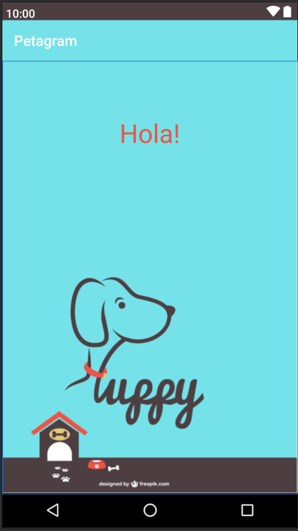
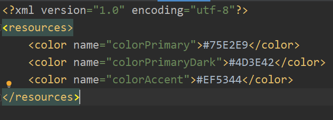
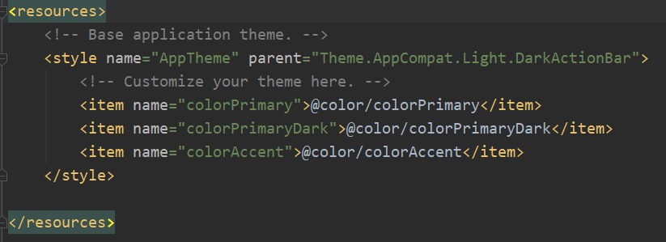

# Petagram - Tarea de la primera Semana: Integrando Material Design

Imagenes para facilitar la revision

<B>Imagen de Muestra de la APP</B> 

<B>Contenido del archivo Colors.xml</B> 

<B>Contenido del archivo styles.xml</B> 

